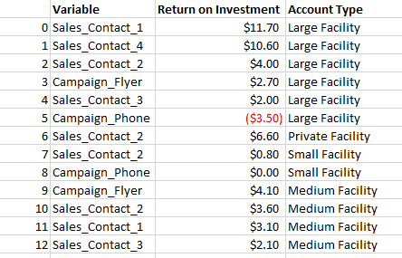

Marketing Strategy Analysis

A market analysis helps you create an effective marketing strategy that aligns with your business goals and objectives. It can reveal the best channels, tactics, and tools to reach your target audience. And how to optimize your marketing budget and resources

# Table of Content

## 1 Introduction
## 2 Data Loading and Quality
## 3 Feature Additions and Engineering
## 4 Exploration Data Analysis and Statistsical Analysis
## 5 Final Recommendation (Optimial Sales)

